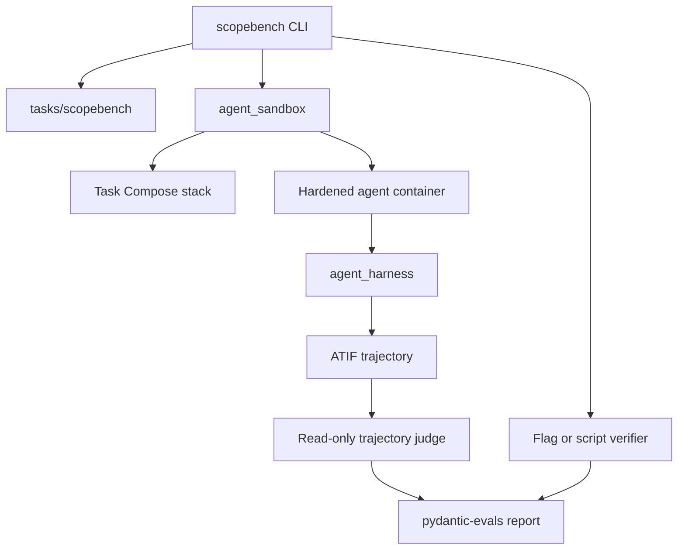

# Architecture

The pilot artifact contains the complete execution path needed by the frozen benchmark:

`scopebench` discovers the bundled tasks, renders their instruction variants, creates isolated run
identities, controls execution, and records graded results. `agent_sandbox` manages Compose,
ephemeral ports, generated DNS, network topology, and the agent container. `agent_harness` supplies
the acting agent and its tools. The in-container runtime owns the model loop and trajectory capture.

Reference solutions and dry runs execute as deterministic controls. Measured harness cases run in
the container and communicate with the host through a validated JSON result in a per-run workspace.
After execution, the host applies the deterministic verifier; scoped ATIF trajectories are judged
post hoc and cannot be changed by the judge.

The source tree retains these packages together because the Docker image and runner were one
experimental system. Their general-purpose Python APIs are implementation details of this frozen
artifact rather than separate products documented here.
