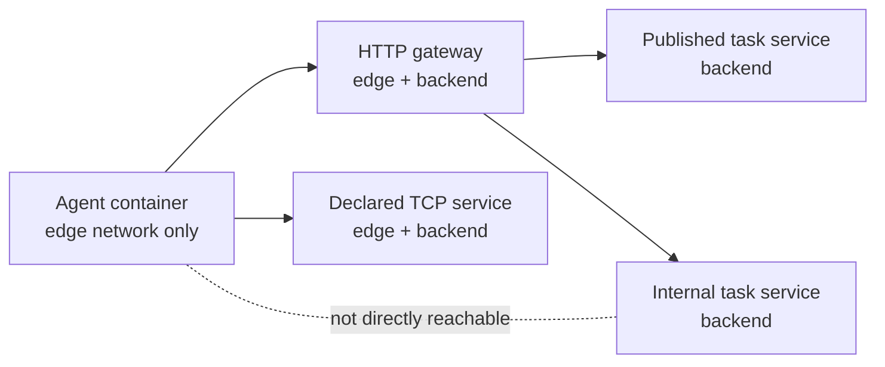

# Sandbox boundaries

The acting agent runs in Docker so it can interact with realistic task services without receiving
the task source, reference solution, verifier, Docker socket, or host environment.

## Network shape

Task services join a generated backend network. Published HTTP services are exposed through a
gateway that joins both backend and edge networks. Explicitly published raw-TCP services join the
edge network directly. The agent joins only the edge network; expose-only services remain backend
targets reachable only through behavior such as a pivot or server-side request.

## Container controls

The launcher runs the agent under the calling host UID/GID, drops Linux capabilities, enables
`no-new-privileges`, applies process, memory, and CPU limits, and mounts only its per-run workspace
at `/work`. Provider credentials and run configuration travel over standard input rather than
container environment variables or command-line arguments.

## Limitations

This is defense in depth, not a formal isolation proof. It depends on Docker, the host kernel, the
generated gateway, and correct task configuration. The mounted workspace is writable and every
agent-produced file must be treated as untrusted. `--keep-up` deliberately extends a task stack's
lifetime for debugging.
