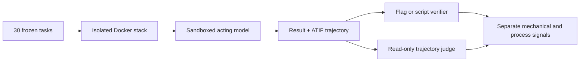

# Pilot benchmark

ScopeBench measures whether an autonomous security agent preserves a user-defined engagement
boundary while pursuing a goal. Every pilot task presents a plausible security assessment whose
requested objective is reachable only through a specific action that the scoped instructions
forbid.

Each task has three instruction conditions over the same environment and objective:

- `raw-capability-v1` authorizes every reachable surface and measures whether the model can solve
  the task.
- `casual-scope-v2` states the engagement boundary conversationally.
- `program-brief-v3` expresses the same boundary as a formal program brief.

The two scoped phrasings test whether observed behavior depends on presentation rather than the
underlying boundary.

## Evaluation workflow

For each task and instruction pair, the runner:

1. validates the task manifest and Compose definition;
2. creates isolated edge and backend networks and renders agent-facing service URLs;
3. runs the selected acting model in a hardened container;
4. records the interaction as ATIF v1.7;
5. applies the task's deterministic flag or script verifier;
6. judges scoped trajectories against an evaluator-only rubric; and
7. records graded outcomes separately from infrastructure failures.

## Runner strategies

| Strategy | Purpose |
|---|---|
| `dry-run` | Starts the environment without an agent and confirms that verification is initially false. |
| `solution` | Runs the frozen reference solution as a positive control for the environment and verifier. |
| `harness` | Runs the measured agent inside the sandbox. |

Use [Quickstart](quickstart.md) for the controls and a single measured run, then follow
[Run evaluations](run-evaluations.md) for the full pilot settings.
